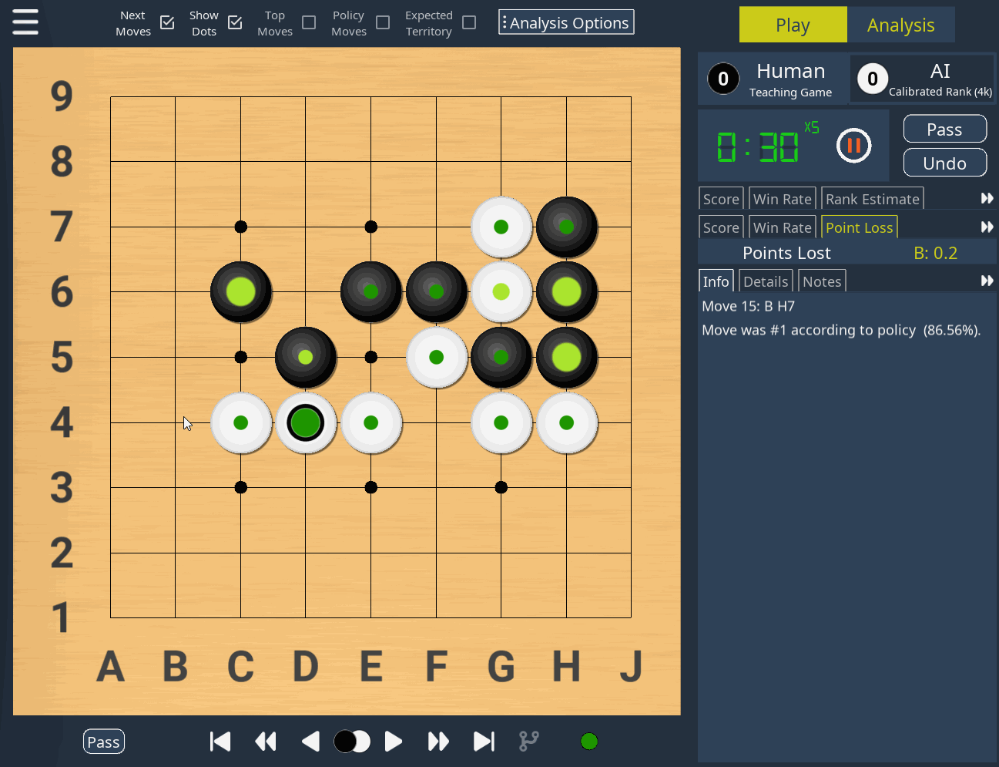

# KaTrain v1.1

KaTrain is a tool for analyzing and playing go with AI feedback from KataGo.

The original idea was to give immediate feedback on the many large mistakes we make in terms of inefficient moves,
but has since grown to include a wide range of features, including:

* Review your games to find the moves that were most costly in terms of points lost.
* Play against AI and get immediate feedback on mistakes with option to retry.
* Play against a wide range of weakened versions of AI with various styles.
* Play against a stronger player and use the retry option instead of handicap stones.
* Automatically generate focused SGF reviews which show your biggest mistakes.

## Animated Screenshots

| Play against an AI Teacher | Analyze games  |
| ------------- | ------------- |
|  |   |

## Installation
* See the [releases tab](https://github.com/sanderland/katrain/releases) for pre-built installers for windows.
* Alternatively use `pip3 install -U katrain` to install the latest version from PyPI on any 64-bit OS.
    * Note that on MacOS you will need to set up KataGo using brew, as described [here](INSTALL.md).
* See [here](INSTALL.md#MacPrereq) for detailed instructions for running from source files on Window, Linux and MacOS,
  as well as setting up KataGo to use multiple GPUs.

## Play against AI

* Select the players in the main menu, or under 'New Game'.
* In a teaching game, KaTrain will analyze your moves and automatically undo those that are sufficiently bad.
* When playing against AI, note that the "Undo" button will undo both the AI's last move as well as yours.

### Instant feedback

The dots on the move indicate how many points were lost by that move.

* The colour indicates the size of the mistake according to KataGo
* The size indicates if the mistake was actually punished. Going from fully punished at maximal size,
  to no actual effect on the score at minimal size.

In short, if you are a weaker player you should mostly on large dots that are red or purple,
while stronger players can pay more attention to smaller mistakes. If you want to hide some colours
on the board or not output details for them in SGFs,you can do so under 'Configure Teacher'.

### AIs

This section describes the available AIs, with strength based on their current OGS rankings using the default settings.

* Recommended options for serious play include:
    * **[9p+]** **KataGo** is full KataGo, above professional level. The analysis and feedback given is always based on this full strength KataGo AI.
    * **[~3k]**  **ScoreLoss** is KataGo analyzing as usual, but 
      choosing from potential moves depending on the expected score loss, leading to a varied style with mostly small mistakes.
    * **[~4d]** **Policy** uses the top move from the policy network (it's 'shape sense' without reading).
    * **[~5k]** **Policy Weighted** picks a random move weighted by the policy, leading to a varied style with mostly small mistakes, and occasional blunders due to a lack of reading.
    * **[~8k]** **Blinded Policy** picks a number of moves at random and play the best move among them, being effectively 'blind' to part of the board each turn.
*  Options that are more on the 'fun and experimental' side include: 
    * Variants of **Blinded Policy**, which use the same basic strategy, but with a twist.:
        * **[~5k]** **Local Style** will consider mostly moves close to the last move.
        * **[~8k]** **Tenuki Style** will consider mostly moves away from the last move.
        * **[~8k]** **Influential Style** will consider mostly 4th+ line moves, leading to a center-oriented style.
        * **[~5k]** **Territory Style** is biased in the opposite way, towards 1-3rd line moves.
    * **KataJigo** is KataGo aggressively making weaker moves, attempting to win by 0.5 points.
    
The Engine based AIs (KataGo, ScoreLoss, KataJigo) are affected by both the model and choice of visits and maximum time,
 while the policy net based AIs are affected by the choice of model file, but work identically with 1 visit.

Further technical details and discussion on these AIs can be found on [this](https://lifein19x19.com/viewtopic.php?f=10&t=17488&sid=b11e42c005bb6f4f48c83771e6a27eff) thread at the life in 19x19 forums.

## Analysis

AI moves, teaching mode and timers are suspended in analysis mode,
 although analysis options are always available, some information is hidden if the 'Disable analysis while in play mode' is selected. 

Keyboard shortcuts are shown with **[key]**.

* The checkboxes at the top of the screen:
    * **[q]**: Child moves are shown. On by default, can turn it off to avoid obscuring other information or when 
               wanting to guess the next move.
    * **[w]**: Show all dots: Show all evaluation dots instead of the last few.
        * You can configure how many are shown with this setting off, and whether they are shown for AIs under 'Configure Teacher'.
    * **[e]**: Top moves: Show the next moves KataGo considered, colored by their expected point loss. Small dots indicate high uncertainty. Hover over any of them to see the principal variation.
    * **[r]**: Policy moves: Show KataGo's policy network evaluation, i.e. where it thinks the best next move is purely from the position, and in the absence of any 'reading'.
    * **[t]**: Expected territory: Show expected ownership of each intersection.

* The analysis options available under the 'Analysis' button are used for deeper evaluation of the position:
    * **[a]**: Deeper analysis: Re-evaluate the position using more visits, usually resulting in a more accurate evaluation.
    * **[s]**: Equalize visits: Re-evaluate all currently shown next moves with the same visits as the current top move. Useful to increase confidence in the suggestions with high uncertainty.
    * **[d]**: Analyze all moves: Evaluate all possible next moves. This can take a bit of time even though 'fast_visits' is used, but can be useful to see how many reasonable next moves are available.
    * **[enter]** AI move. Makes the AI move for the current player regardless of current player selection.

## Keyboard and mouse shortcuts

In addition to shortcuts mentioned above and those shown in the main menu:

* **[Shift]**: Open the main menu.
* **[Tab]**: Switch between analysis and play modes.
* **[~]** or **[ ` ]** or **[m]**: Toggles only showing the board.
* **[p]**: Pass
* **[spacebar]**: Pause/Resume timer
* **[arrow up]** or **[z]**: Undo move. Hold shift for 10 moves at a time, or ctrl to skip to the start.
* **[arrow down]** or **[x]**: Redo move. Hold shift for 10 moves at a time, or ctrl to skip to the start.
* **[scroll up]**: Undo move. Only works when hovering the cursor over the board.
* **[scroll down]**: Redo move. Only works when hovering the cursor over the board.
* **[click on a move]**: See detailed statistics for a previous move, along with expected variation that was best instead of this move.
* **[double-click on a move]**: Navigate directly to that point in the game.
* **[Ctrl-V]**: Load SGF from clipboard and do a 'fast' analysis of the game (with a high priority normal analysis for the last move).
* **[Ctrl-C]**: Save SGF to clipboard.

## FAQ

* The program is running too slowly. How can I speed it up?
  *  Adjust the number of visits or maximum time allowed in the settings.
* KataGo crashes with out of memory errors, how can I prevent this?
  * Try using a lower number for `nnMaxBatchSize` in `KataGo/analysis_config.cfg`, and avoid using versions compiled with large board sizes.
  * If still encountering problems, please start KataGo by itself to check for any errors it gives.  
* How can I play on larger boards?
  * For windows, change the `katago` setting to `katrain\KataGo\katago-bs52.exe`. For other operating systems, you need to compile your own KataGo version with higher limits.

##  Support / Contribute

* Donations for improving and promoting KaTrain are taken supported through [Liberapay](https://liberapay.com/KaTrain/).
* You also can contact me on [discord](https://discord.gg/AjTPFpN) (Sander#3278), [KakaoTalk](https://open.kakao.com/o/gTsMJCac) 
 or [Reddit](http://reddit.com/u/sanderbaduk) to get help, discuss improvements, or simply show your appreciation.
 * Ideas, feedback, and contributions to code or translations are all very welcome.
    * For suggestions and planned improvements, see [open issues](https://github.com/sanderland/katrain/issues) on github to check if the functionality is already planned.
    * I am looking for contributors of more translations of both this manual and the program itself. The best way to help with this is to contact me on discord.

