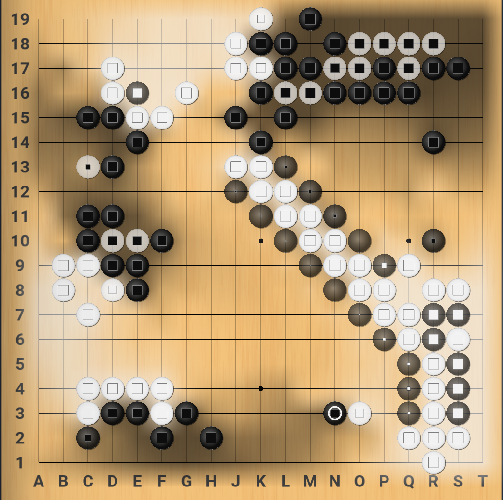
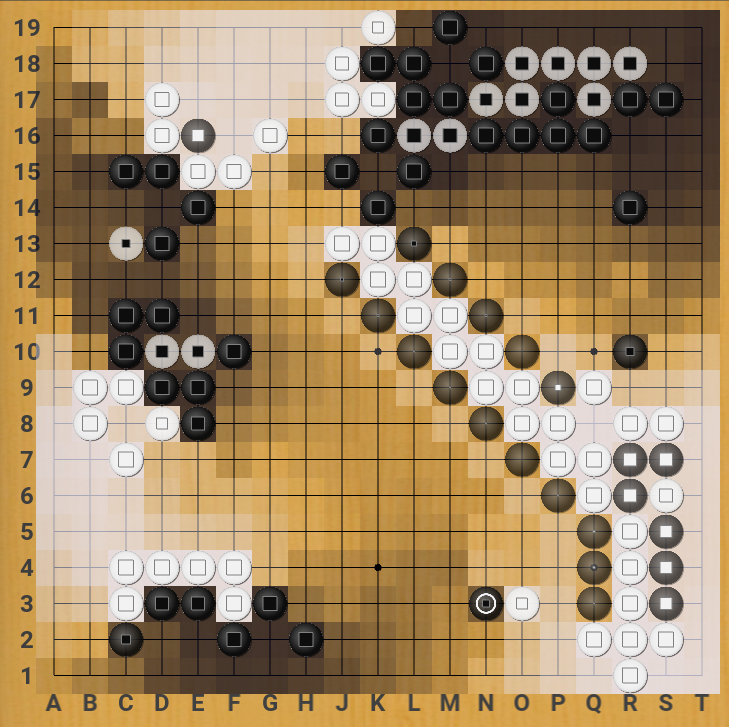
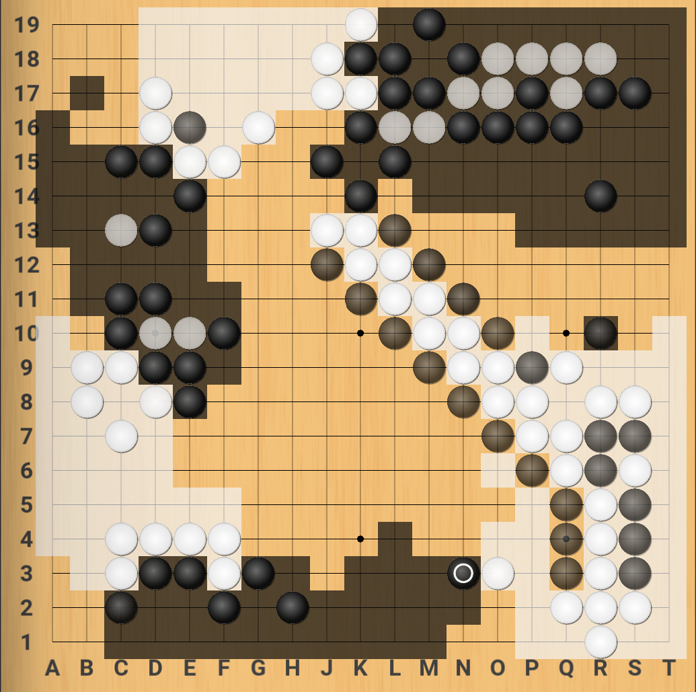
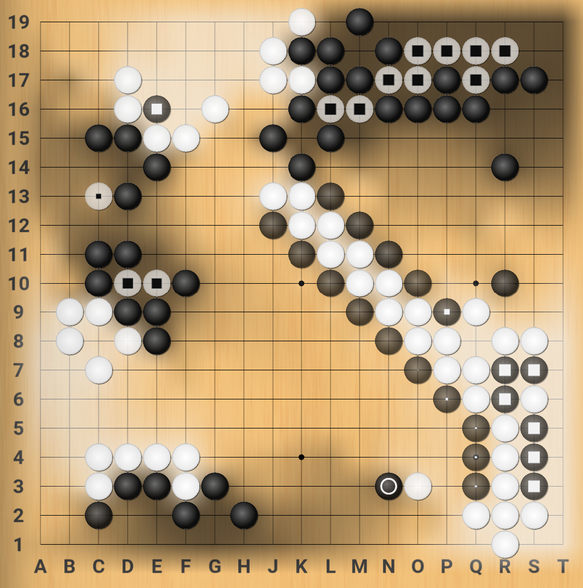
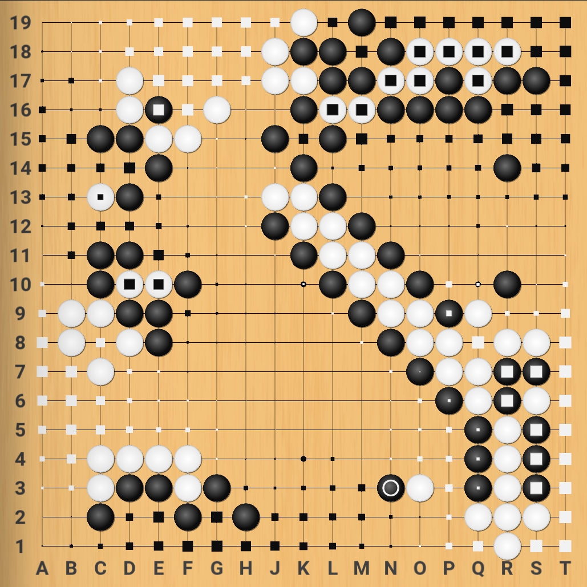
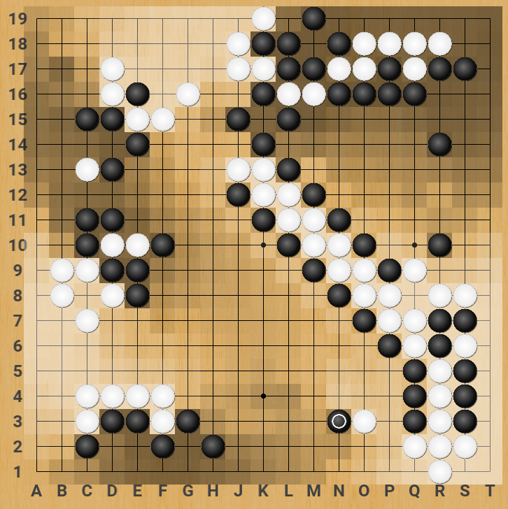

# Themes

Version 1.7 brings basic support for themes, and 1.9 extends it to include keyboard shortcuts and support for multiple theme files.

## Creating and editing themes

* Look at the `Theme` class in [`katrain/gui/theme.py`](https://github.com/sanderland/katrain/blob/master/katrain/gui/theme.py).
* Make a `theme<yourthemename>.json` file in your `<home dir>/.katrain` directory and specify any variables from the above class you want to override, e.g. 
 ```json
 {
  "BACKGROUND_COLOR": [1,0,0,1],
  "KEY_STOP_ANALYSIS": "f10",
  "MISTAKE_SOUNDS": ["jeff.wav","what.wav"]
}
  ```
* All resources (including icons, which can not be renamed for now) will be looked up in `<home dir>/.katrain` first, so files with identical names there can be used to override sounds and images.
* If variables are specified in multiple theme files, the *latest* alphabetically takes precedence. That is, each later theme file overwrites the settings from any previous one.

## Expected territory options

* KaTrain supports different styles of display of expected territory:
  * Blended style colors the board with an intensity proportional to the likelihood of a player controlling that territory at the end of the game.
  * Shaded style behaves the same as Blended, but uses square shades similar to
  the Katago paper.
  * In the Marks style, each point of the board is marked with a square of size which is proportional to ownership likelihood.
  * The Blocks style divides the whole board into black, white, and neutral territory, based on a likelihood threshold. This style is appropriate as a counting aid, but may be misleading before endgame if much of the territory is unsettled.
* Marks can also appear on stones to indicate the likelihood of these stones living at the end of the game. Three styles are supported:
  * All stones can be marked, with the color of the mark indicating the expected ownership and the size of the mark indicating certainty.
  * Weak stones only - marks will appear only on stones which are over 50% likely to die before the end of the game.
  * No stone marks.
* Stones can also be made transparent based on their strength.

|  <br> Blended style, all stones marked|  <br> Shaded style, all stones marked |
| --- | ---|
|  <br> Territory blocks, no stones marked |  <br> Blended territory, weak stones marked |
|   <br> Marks on intersections, weak stones marked |   <br> Shaded, no stone alpha |
                             

<sup>The game used in the screenshots is [Albert Yen vs. Eric Yoder](https://www.usgo.org/news/2022/03/members-edition-midwest-open-round-2-the-broken-ladder-game).</sup>

The stone marks, transparency, and territory style are independent; the table above presents a collection of possible variants.
The relevant variables are:
```
    TERRITORY_DISPLAY = "blended" | "shaded" | "marks" | "blocks"
    STONE_MARKS = "all" | "weak" | "none"
    OWNERSHIP_COLORS = {"B": [0.0, 0.0, 0.10, 0.75], "W": [0.92, 0.92, 1.0, 0.800]}
    BLOCKS_THRESHOLD = 0.6
    MARK_SIZE = 0.42  # as fraction of stone size
    STONE_MIN_ALPHA = 0.5
```

The colors are specified as RGB values and a maximum alpha transparency.

## Installation

* To install a theme, simply unzip the theme.zip to your .katrain folder. 
  * On Windows you can find it in C:\Users\you\\.katrain and on linux in ~/.katrain.
  * When in doubt, the general settings dialog will also show the location.
* To uninstall a theme, remove theme.json and all relevant images from that folder.

## Available themes

### Alternate board/stones theme by "koast"

[Download](https://github.com/sanderland/katrain/blob/master/themes/koast-theme.zip)


### Lizzie-like theme

* Theme created by Eric W, includes modified board, stones
* Images taken from [Lizzie](https://github.com/featurecat/lizzie/) by featurecat and contributors.
* Hides hints for low visit/uncertain moves instead of showing small dots. 

[Download](https://github.com/sanderland/katrain/blob/master/themes/eric-lizzie-look.zip)


### Jeff sounds

* This theme makes Jeff comment `Ahhh?` and `What?!` when you make mistakes.
* Sounds provided by Mikkgo.

[Download](https://github.com/sanderland/katrain/blob/master/themes/jeff-sounds.zip)

